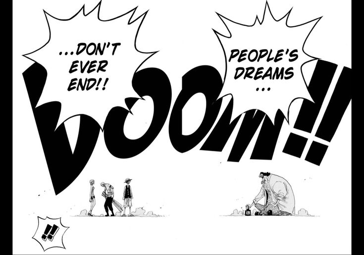

## First Blog 

So I just prompt how to express my hapinness on writing my first blog on my personal site to GPT, and it give me a so nerdy-linkedin-weird answer lmao.So yeah welcome to my first blog I'm pretty much locked in for the new year, having positive energy around me for the upcoming year.

I will try to make this as raw as i can.I ain't a professional content-writer or something which gives me so much freedom to express my thoughts lol.

## 2024 in a nutshell !

I will not brag about 2024 as it was not as i expected.Entered the year with a beginner in web-development.Just knew HTML,CSS,JS before now my primary stack is **NextJS,Typescript,ShadCN,TailwindCSS**.Built some projects here and there in the above mentioned techstack and MERN. Achieved **Expert** on CodeForces and retired from Competitive Programming after that. I will be getting back to it tho. Achieved all of the above things in my first half of the year the other half i spent just messing around here and there, was kind of lost.But we move on.

## Things i will be doing in 2025 

Of course, it's impossible to plan an entire year, so these are the goals and activities I'll be focusing on during the first half of the year.

### Tech

Technologies I will be learning and strenghtening:

1. React/NextJS
2. Typescript
3. Postgress-Express-Next-Node Stack
4. Tanstack Query
5. Golang
6. React-Native

Continously solving some LC and giving contests consistently on CodeForces,CodeChef,Leetcode. I will try to complete [Striver's A2Z sheet](https://takeuforward.org/strivers-a2z-dsa-course/strivers-a2z-dsa-course-sheet-2/) by February. Also I will be writing some blogs for the CSES problemset and will start a weekly series of the problems i solved in my contests. How i approached them and their intuition. 

Also I will be revising the core CS Fundamentals(DBMS, CN, OS, OOPS) for the interviews.I will try to write some good blogs on this too.

That's the high-level idea of my first half of this year.

### Other

Besides the tech world, I will try to write more blogs around my experiences—tech, non-tech, or whatever. I will be reading 2-3 books every month and might start a series Books I read in X Month.

Thanks for checking this out. Wishing you all a very happy new year, and may all your wishes come true.

